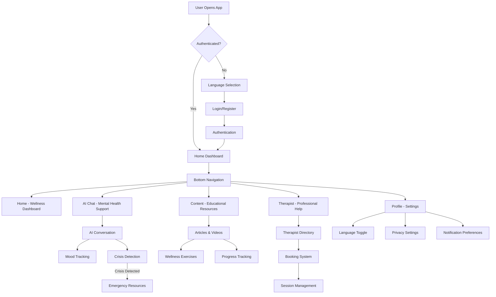
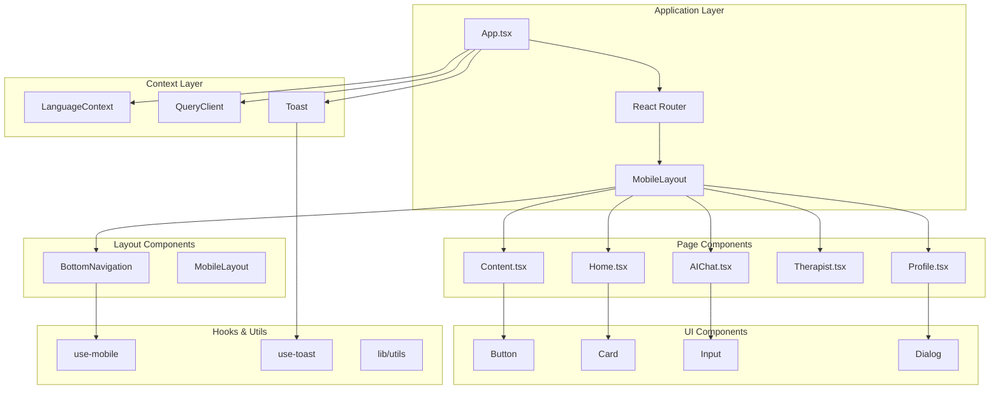
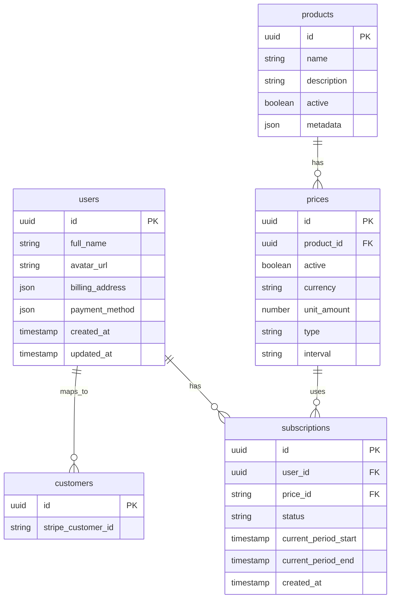
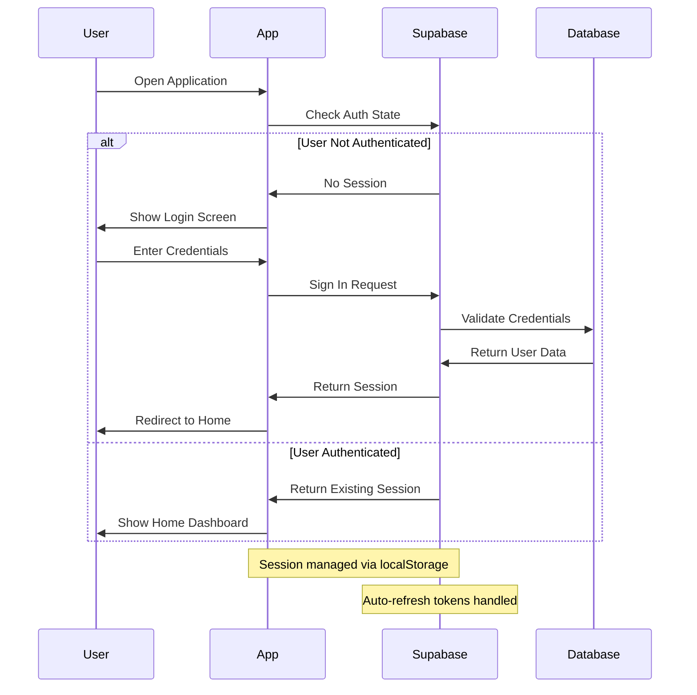
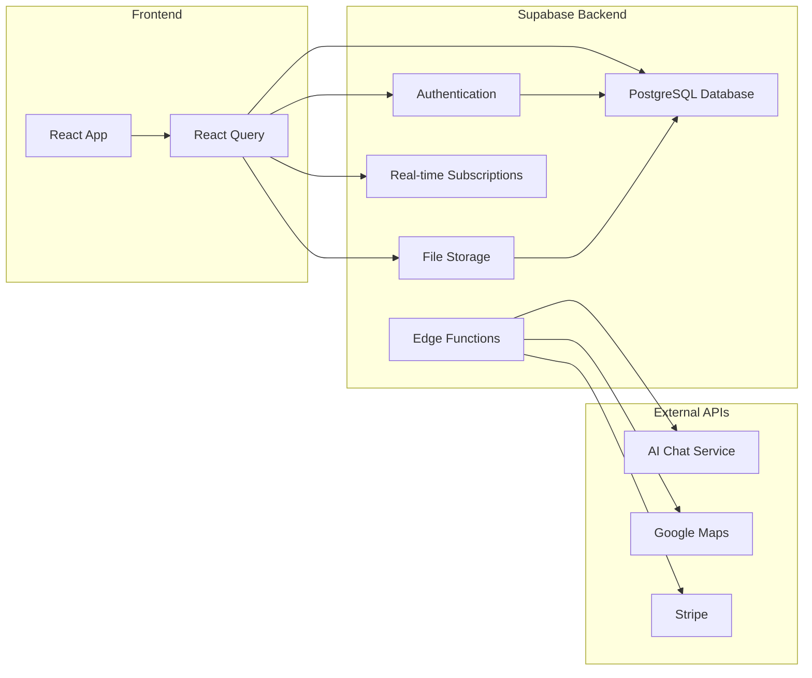
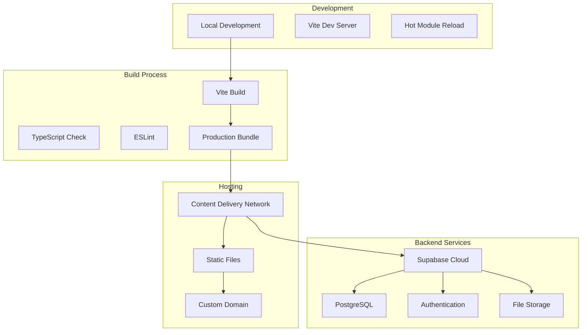

# System Design Documentation - Jai Dee Mental Wellness App

## Table of Contents
1. [System Overview](#system-overview)
2. [User Flow Diagram](#user-flow-diagram)
3. [Component Architecture](#component-architecture)
4. [Database Schema](#database-schema)
5. [Authentication Flow](#authentication-flow)
6. [API Architecture](#api-architecture)
7. [Deployment Architecture](#deployment-architecture)
8. [Integration Points](#integration-points)

## System Overview

Jai Dee is a mobile-first mental wellness application designed specifically for Thai users, offering AI-powered chat support, educational content, and professional therapist connections. The application follows a modern React architecture with TypeScript, utilizing Supabase for backend services.

## User Flow Diagram

## Component Architecture

## Database Schema

## Authentication Flow

## API Architecture

## Deployment Architecture

## Integration Points

### 1. Supabase Database Integration
**Purpose**: Primary backend for user data, content management, and real-time features
- **Connection**: `@/integrations/supabase/client.ts`
- **Authentication**: Row Level Security (RLS) policies
- **Real-time**: WebSocket connections for live updates
- **Security**: JWT token-based authentication

### 2. React Query Integration
**Purpose**: Data fetching, caching, and synchronization layer
- **Configuration**: Optimistic updates and background refetching
- **Error Handling**: Automatic retry logic with exponential backoff
- **Caching**: Intelligent cache invalidation strategies

### 3. Internationalization (i18n)
**Purpose**: Thai/English language support
- **Implementation**: Context-based language switching
- **Fonts**: Google Fonts (Sarabun for Thai, Poppins for English)
- **RTL Support**: Prepared for future Arabic/Hebrew support

### 4. UI Component Library
**Purpose**: Consistent design system implementation
- **Library**: shadcn/ui with Radix UI primitives
- **Theming**: Custom CSS variables for Thai cultural colors
- **Accessibility**: WCAG 2.1 AA compliance

### 5. Mobile-First Design
**Purpose**: Optimized mobile experience
- **Responsive**: Tailwind CSS breakpoints
- **Touch**: Gesture-friendly interactions
- **Performance**: Lazy loading and code splitting

### 6. State Management
**Purpose**: Application state coordination
- **Global State**: React Context for language and authentication
- **Local State**: React hooks for component state
- **Persistence**: LocalStorage for user preferences

## Component Descriptions

### Core Layout Components

**MobileLayout (200-300 words)**
The MobileLayout component serves as the primary structural foundation for the entire Jai Dee application. It implements a mobile-first design philosophy that ensures optimal user experience across all device sizes. The component features a gradient background that evokes the calming nature of Thai wellness traditions, using custom CSS classes like `bg-wellness-gradient` that blend soft blues and mint greens. The layout maintains a consistent max-width container that centers content on larger screens while utilizing full width on mobile devices. The component includes bottom padding to accommodate the fixed bottom navigation, preventing content from being obscured. It also implements the modern iOS-style safe area handling to ensure content visibility on devices with notches or home indicators.

**BottomNavigation (200-300 words)**
The BottomNavigation component represents the primary navigation interface for the Jai Dee application, designed specifically for mobile-first interaction patterns. It implements a five-tab navigation system covering Home, AI Chat, Content, Therapist connections, and Profile management. Each navigation item features carefully selected Lucide React icons that provide universal recognition while maintaining cultural sensitivity. The component integrates deeply with the LanguageContext to provide seamless Thai/English text switching. Visual feedback is provided through gradient backgrounds that activate on selection, with each tab having its own unique color scheme that reflects the emotional tone of its content area. The navigation includes subtle animations and hover effects that enhance the user experience without overwhelming the interface. The component uses React Router's location detection to maintain accurate active states and implements proper accessibility features including semantic navigation roles.

### Feature Pages

**AIChat (200-300 words)**
The AIChat page implements the core AI-powered mental health conversation feature that distinguishes Jai Dee from other wellness applications. The component is designed to provide a safe, judgment-free environment where users can discuss their mental health concerns with an AI assistant trained in Thai cultural context and mental health best practices. The interface mimics familiar chat applications while incorporating wellness-specific features like mood tracking, crisis detection, and resource suggestions. The component integrates with Supabase for conversation persistence and implements real-time message delivery. Special attention is paid to privacy and security, with end-to-end encryption considerations and careful data handling. The AI responses are designed to be culturally appropriate for Thai users while maintaining professional mental health support standards.

**Home (200-300 words)**
The Home page serves as the primary dashboard for users' mental wellness journey, providing a comprehensive overview of their progress and immediate access to key features. The design incorporates Thai design principles with gentle curves, natural color palettes, and harmonious spacing that promotes a sense of calm and well-being. The dashboard includes personalized wellness metrics, recent activity summaries, and quick access buttons to core features. Weather-aware wellness suggestions adapt to Bangkok's climate and seasonal patterns. The component implements progressive disclosure, showing basic information initially with options to drill down into detailed analytics. Integration with the user's profile allows for personalized recommendations and culturally relevant content suggestions based on their preferences and usage patterns.

## Security Considerations

### Data Protection
- End-to-end encryption for sensitive conversations
- GDPR compliance for EU users
- Thai Personal Data Protection Act (PDPA) compliance
- Secure storage of mental health data

### Authentication Security
- Multi-factor authentication support
- Session management with secure token refresh
- Rate limiting on authentication endpoints
- Account lockout protection

### Privacy Features
- Anonymous chat options
- Data retention policies
- User data export capabilities
- Right to be forgotten implementation

---
*Last Updated: December 2024 | Version: 1.0 | Architecture Review: Q4 2024*
